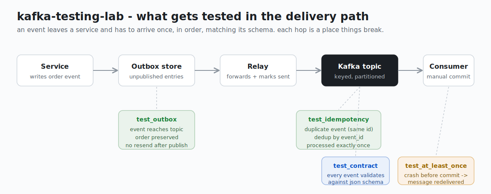

# kafka-testing-lab

   

Test suite for event-driven services built on Apache Kafka. Covers reliability scenarios that most projects skip: outbox relay, idempotency, at-least-once delivery guarantees, and contract checks on message schemas.

Built while covering 12 Kafka integrations at work - outbox, idempotency, retry loops, gRPC/REST contract mismatches. This repo is a distilled version of patterns I kept rewriting.




## What's tested

- **Idempotency** - producer sends duplicate events (same key + id), consumer deduplicates, asserts processed once
- **At-least-once delivery** - consumer crashes before commit, restarts, message redelivered and handled
- **Outbox relay** - event written to outbox lands in Kafka topic with order preserved
- **Contract** - each event in the topic validates against the JSON schema (`schemas/order_event.json`)

## Stack

Python 3.11+, confluent-kafka, pytest, Docker

## Run locally

```bash
docker-compose up -d
pip install -r requirements.txt
pytest -v
```

Kafka will be at `localhost:9092`. Give it ~15s to start before running tests.

To watch topics live: open Kafka UI at http://localhost:8080 (if you kept it in compose).

## Project layout

```
app/
  producer.py     - thin wrapper, keyed sends, delivery callback
  consumer.py     - poll loop, manual commit, consumer groups
  outbox.py       - in-memory outbox + relay (simplified, real one uses a db table)
schemas/
  order_event.json
tests/
  conftest.py     - fixtures: admin client, per-test topics, producer/consumer
  test_idempotency.py
  test_at_least_once.py
  test_outbox.py
  test_contract.py
```

## Notes

Outbox relay here is in-memory. In production we use a db table + a separate relay process watching it with a debezium CDC connector. The test logic is the same - event lands in the topic, order is preserved.

Consumer group ids are randomized per test to avoid state bleed between runs.

Timeout on slow Kafka ops is 10s by default (`pytest.ini`), can bump via `KAFKA_TIMEOUT` env.
